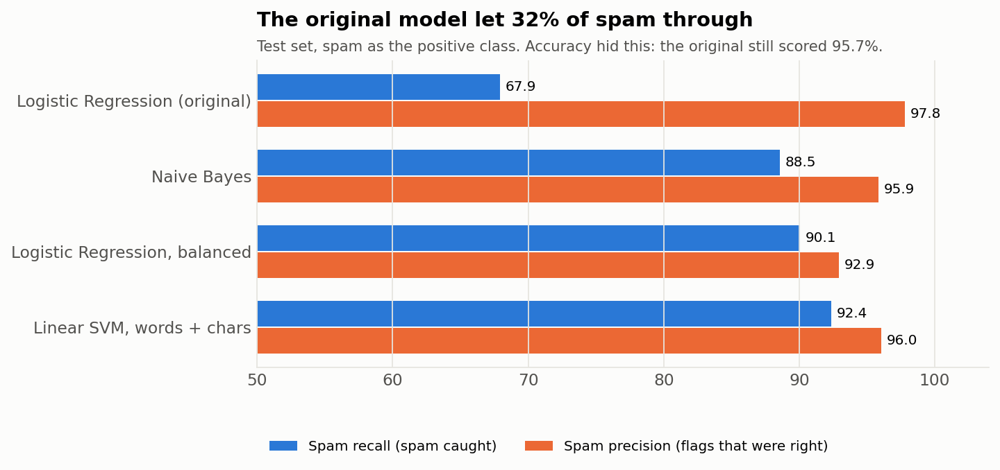
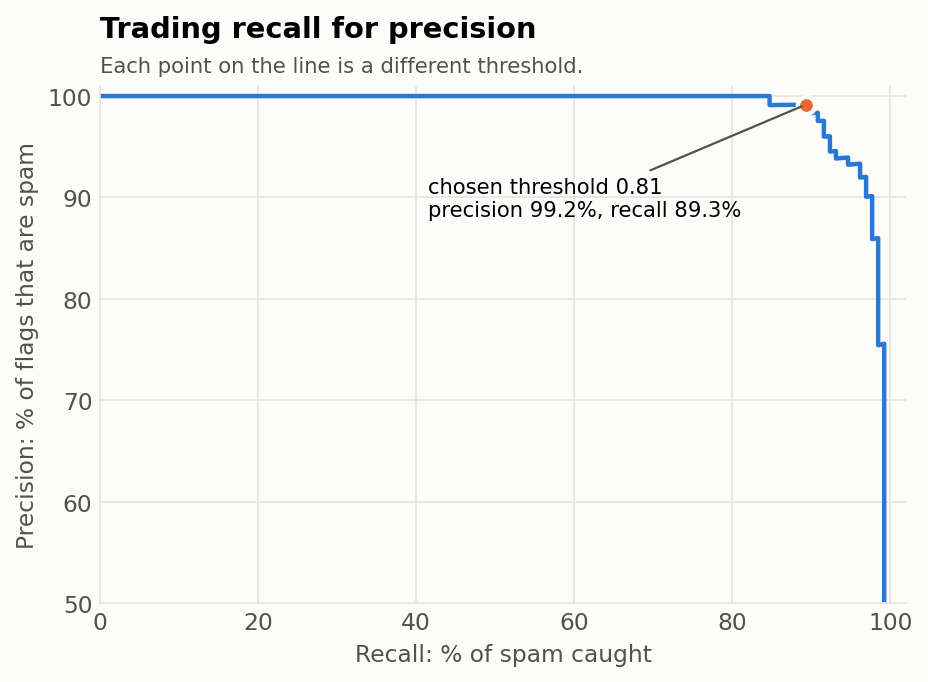
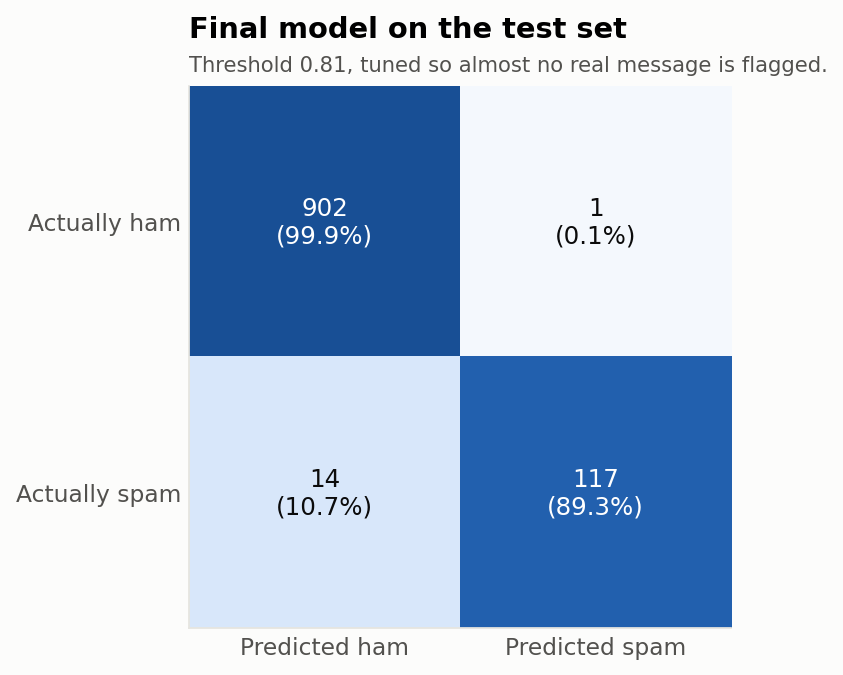

# 📩 Spam SMS Classifier: why 96% accuracy wasn't good enough

**A spam filter for SMS, built twice. Version 1 followed a tutorial and reported 96.6% accuracy. Version 2 found that it let about a third of spam through, and fixed it.**


---

## Results

| | v1 (tutorial) | **v2 (final)** |
|---|---:|---:|
| Accuracy (test) | 95.7% | **98.5%** |
| Spam caught (recall) | 67.9% | **89.3%** |
| Flags that were really spam (precision) | 97.8% | **99.2%** |
| Spam missed (out of 131) | 42 | **14** |
| Real messages wrongly sent to spam (out of 903) | 2 | **1** |

*v1 scored 96.6% in the tutorial setup; it drops to 95.7% once duplicate messages are removed from the test set.*



---

## What I changed, and why

**1. Accuracy was hiding the real problem.**
Only 12.6% of messages are spam, so a model that answers "ham" every single time is already 87% accurate.
I switched to treating **spam as the positive class** and tracking **precision** (when it flags spam, is it right?) and **recall** (how much spam does it catch?).
That showed v1 caught only 68% of spam.

**2. Duplicates were leaking into the test set.**
403 messages (7%) were exact copies, mostly repeated spam blasts. With a random split, the same text can end up in both training and testing, so the model gets graded on messages it has already seen.
I removed duplicates **before** splitting.

**3. I compared models properly instead of trusting one.**
Using 5-fold cross-validation on the training set:

| Model | Spam F1 (cross-validated) |
|---|---:|
| Always say "ham" (dummy baseline) | 0.000 |
| Logistic Regression (v1) | 0.777 |
| Logistic Regression, class-balanced | 0.925 |
| Naive Bayes | 0.933 |
| **Linear SVM on word + character n-grams** | **0.959** |

Character n-grams help with spammer tricks like `FR33`, `£1000`, `txt` and odd spacing, which whole words miss.

**4. I chose the threshold based on which mistake costs more.**
Hiding a real message in the spam folder is worse than letting one spam through. So instead of the default 0.5 cut-off, I picked the threshold (0.81) that keeps **precision at or above 99%**.
On the test set, only **1** real message out of 903 was flagged, and 117 of 131 spam messages were caught.

<p>


</p>

---

## A limitation I found by testing

```text
$ python src/predict.py "URGENT: your account will be blocked, update KYC at bit.ly/xyz"
ham   (29% spam)
```

The dataset is from 2011 and mostly UK messages, so the model has never seen modern Indian scams like KYC updates, fake electricity bills or UPI collect requests.
This is **data drift**: a model is only as current as its training data. The next step is to collect and label recent Indian scam SMS and retrain.

---

## Run it

```bash
git clone https://github.com/aryan-novice/spam-sms-classifier.git
cd spam-sms-classifier
pip install -r requirements.txt

python src/train.py                          # compare models, save the best one + charts
python src/predict.py "WIN a free trip! Call now" "see you at 6?"
```

## Files

```
├── data/spam.csv                          # 5,572 labelled SMS messages
├── notebooks/
│   ├── 01_tutorial_baseline.ipynb         # v1: my first version, following a tutorial
│   └── 02_improved_classifier.ipynb       # v2: the walkthrough of every fix above
├── src/
│   ├── train.py                           # dedupe, compare models, tune threshold, save
│   └── predict.py                         # classify messages from the command line
├── models/spam_model.joblib               # final model + its threshold
└── reports/                               # metrics.json, error_samples.csv, charts
```

## Dataset

[SMS Spam Collection](https://archive.ics.uci.edu/dataset/228/sms+spam+collection), Almeida & Hidalgo, UCI Machine Learning Repository (CC BY 4.0). 5,572 messages: 4,825 ham and 747 spam.

## What I learned

- Always compare against a dummy baseline. "96% accurate" means little when 87% is free.
- Check for duplicates before splitting, or the test score lies.
- Pick metrics and thresholds based on what a mistake costs the user.
- Test on real, recent examples. That's how I found the data-drift problem.

---

**Aryan Raj** · [GitHub](https://github.com/aryan-novice) · [LinkedIn](https://www.linkedin.com/in/aryan-raj-4b0301374)
